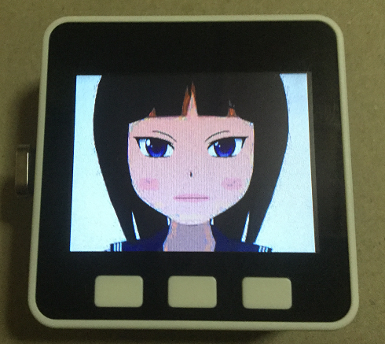

# AvatarPngGirl1_mp3
M5StackでAvatarPngGirl1アバターの表示とmp3ファイル再生

  
アバター表示は、mongonta0716 さんの AvatarPngGirl1 をベースにさせていただきました。 
オリジナルはこちら。 
M5Stack-Avatar-collection/sketchbook/AvatarPngGirl1 <https://github.com/mongonta0716/M5Stack-Avatar-collection/tree/master/sketchbook/AvatarPngGirl1>  
mp3ファイル再生は、M5Stack Libraryのexample"PlayMP3FromSDToDAC"をベースにさせていただきました。 

---
### 必要な物 ###
* [M5Stack](http://www.m5stack.com/ "Title") (M5GOで動作確認をしました。) 
* Arduino IDE (1.8.5で動作確認をしました。) 
* [Arduino core for the ESP32](https://github.com/espressif/arduino-esp32 "Title")
* [M5Stack Library](https://github.com/m5stack/M5Stack.git "Title")
* [ESP8266Audio](https://github.com/earlephilhower/ESP8266Audio/ "Title")
* [M5Stack-SD-Updater](https://github.com/tobozo/M5Stack-SD-Updater/ "Title")
* [M5Stack_TreeView](https://github.com/lovyan03/M5Stack_TreeView/ "Title")  

### ESP8266Audioライブラリの修正 ###
* "AudioOutputI2S.h"に下図赤枠部分を追加します。
  
* "AudioOutputI2S.cpp"に下図赤枠部分を追加します。
 
   

### 操作方法 ###
1. SDカードに"/mp3"というディレクトリを作り、mp3ファイルを入れておきます。
2. M5StackのBボタンでmp3ファイル選択＆再生開始します。
3. M5StackのCボタンで再生停止します。
   
